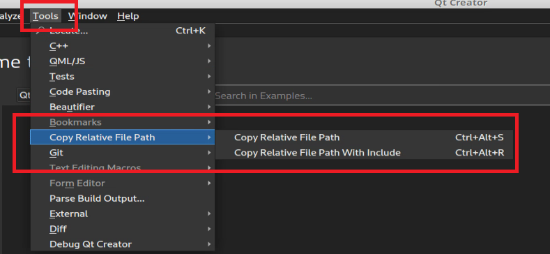
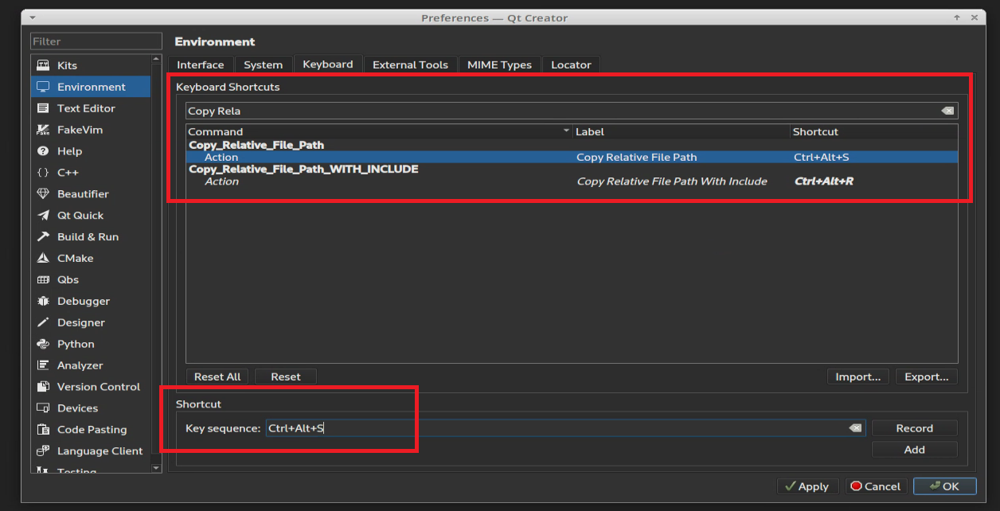

# Plugin for Qt Creator to copy relative file path.

## Overview

Small plugin for Qt Creator which allows you to copy a relative path to a file, or copy it with the prefix "#include ".

## Brief instructions

1. Clone repo:
```console
git clone https://github.com/iskander-saitbatalov/copy_relative_file_path.git
```

2. Build plugin:

```console
cd copy_relative_file_path
./build.sh
```

3. Install plugin.

  3.1. From command line

  ```console
  qtcreator -pluginpath ../out/Release/
  ```

  3.2. Or from settings in plugin (in this case you have to select generated ZIP archieve in `../out/` directory):


## How to use
After installation you will have two new commands which are available in "Tools" menu and then "Copy Relative File Path" menu:

1. You can just press that buttons:



2. Also you can assign convenient key shortcuts in Qt Creator Preferences Menu ("Edit" -> "Preferences" -> "Environment" -> "Keyboard"):



